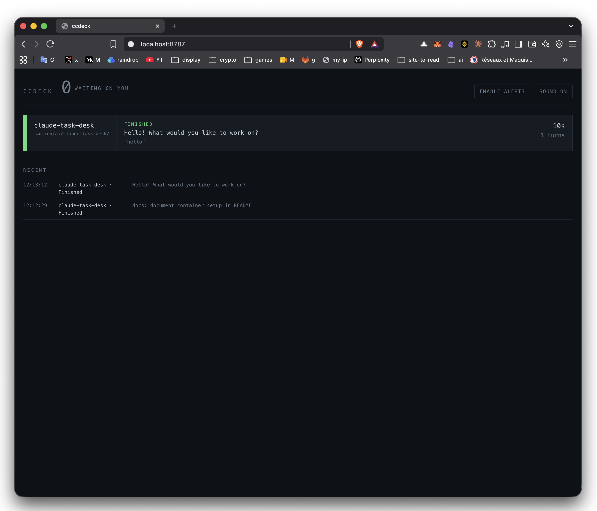
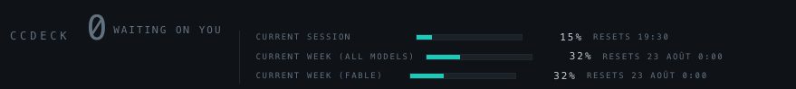

# ccdeck — one board for every Claude Code session

A single page that shows every Claude Code session running on your machine: which
project, what it's doing, how long it's been doing it, and which ones are blocked
waiting on you. Alerts fire in the browser, in the terminal, and optionally on your
phone.

No dependencies — Python 3 standard library only. Nothing leaves your machine
unless you turn on phone push.



## 1. Start the board

Either directly:

```bash
python3 ccdeck.py
# ccdeck listening on http://127.0.0.1:8787
```

or in Docker, which is the better bet if you want the board simply always there:

```bash
docker compose up -d
```

Same board, same URL either way. Open [http://127.0.0.1:8787](http://127.0.0.1:8787) and click **Enable
alerts** once so the browser can raise desktop notifications, then leave the tab pinned.

### Keeping it running

The compose service is `restart: always`, so the board survives crashes and comes back
on its own the next time the Docker daemon starts — a reboot restores it with nothing
for you to do. Two conditions: Docker Desktop has to launch at login (**Settings →
General → Start Docker Desktop when you log in**), and a container only auto-starts if
it was running when Docker stopped. `docker compose down` is therefore also how you opt
out until you next bring it up.

Running the script directly, that part is yours to arrange — a LaunchAgent, or a VS Code
task you start once and forget.

### Working with the container

The port is published on host loopback only, so the hook URL in step 2 is unchanged.
Optional knobs go in a `.env` beside the compose file:

```bash
CCDECK_NTFY_TOPIC=di-ccdeck-<something-random>
CCDECK_HOST_PORT=8787     # host-side port, if 8787 is taken
CCDECK_ALERT_IDLE=0
CCDECK_USAGE_EVERY=30     # seconds between usage rescans, 0 to switch the strip off
```

```bash
docker compose logs -f          # the board's own output
docker compose up -d --build    # after editing ccdeck.py
docker compose down             # stop, and stop auto-starting
```

One read-only volume and no network beyond that one published port: the container
serves the board and cannot reach your projects. The volume is `~/.claude/projects`,
mounted `:ro`, and it is only there so the usage strip can total your tokens; drop it
and the rest of the board is unchanged. The paths on each strip are host paths the hooks
report, carried in the payload and displayed as text.

### What the container setup is

Three files, and none of them large:

| File | What it does |
|---|---|
| `Dockerfile` | `python:3.13-slim`, no install step at all — ccdeck is standard library, so the image is the interpreter plus one file. Runs as `nobody`. Healthcheck polls `/api/state`, which exercises the lock and the snapshot, so a wedged board reports unhealthy instead of merely staying up |
| `docker-compose.yml` | `restart: always`, the port published on `127.0.0.1` only, `~/.claude/projects` mounted read-only for the usage strip, and the env knobs above passed through from your shell or `.env` |
| `.dockerignore` | An allowlist — `ccdeck.py` is the only thing that enters the build context |

Beyond that the service is read-only rootfs with a tmpfs `/tmp` (all state is in memory
and dies with the process), `no-new-privileges`, and json logs capped at 3 × 5 MB so an
always-on container can't fill the disk.

Three details are load-bearing and look like clutter until they aren't:

- **`COPY --chmod=0644`** — `COPY` otherwise preserves the host file's mode, and
  `ccdeck.py` is `0600` here, so `nobody` gets `Errno 13` and `restart: always` turns
  that into a crash loop.
- **`init: true`** — tini as PID 1. Python as PID 1 installs no SIGTERM handler, so the
  kernel discards the signal and every `down` or `restart` waits out the full 10-second
  grace period before SIGKILL.
- **`PYTHONUNBUFFERED=1`** — without it stdout block-buffers when it isn't a terminal
  and `docker compose logs` sits there empty.

Restarting clears the board, since nothing is persisted; each session reappears on its
next hook event.

## 2. Wire Claude Code to it

Add this to `~/.claude/settings.json` (user scope = every project, every terminal).
If you already have a `hooks` block, merge the events in.

```json
{
  "hooks": {
    "SessionStart":     [{ "hooks": [{ "type": "http", "url": "http://127.0.0.1:8787/hook", "timeout": 5 }] }],
    "UserPromptSubmit": [{ "hooks": [{ "type": "http", "url": "http://127.0.0.1:8787/hook", "timeout": 5 }] }],
    "Notification":     [{ "hooks": [{ "type": "http", "url": "http://127.0.0.1:8787/hook", "timeout": 5 }] }],
    "Stop":             [{ "hooks": [{ "type": "http", "url": "http://127.0.0.1:8787/hook", "timeout": 5 }] }],
    "SubagentStop":     [{ "hooks": [{ "type": "http", "url": "http://127.0.0.1:8787/hook", "timeout": 5 }] }],
    "StopFailure":      [{ "hooks": [{ "type": "http", "url": "http://127.0.0.1:8787/hook", "timeout": 5 }] }],
    "SessionEnd":       [{ "hooks": [{ "type": "http", "url": "http://127.0.0.1:8787/hook", "timeout": 5 }] }]
  }
}
```

Restart your Claude Code sessions, or run `/hooks` in a running one to confirm the
handlers are registered under **User Settings**.

Optional, for a live "running Bash…" line on each strip, add `PreToolUse` the same
way. It's one POST per tool call, so only turn it on if you want that detail.

### If the board is down

Hooks fail open. A connection refused is a non-blocking error: Claude Code logs it
and carries on. Your sessions never wait on this server.

### Locking the endpoint down

If you want to be explicit about which URLs hooks may call, add to the same file:

```json
{ "allowedHttpHookUrls": ["http://127.0.0.1:8787/hook"] }
```


## 3. Alerts


| Channel                      | How to turn it on                                                                                                                                                                                |
| ---------------------------- | ------------------------------------------------------------------------------------------------------------------------------------------------------------------------------------------------ |
| Browser notification + chime | Click **Enable alerts** on the board                                                                                                                                                             |
| Tab badge                    | Automatic — the title shows `(2) ccdeck`                                                                                                                                                         |
| Terminal bell / native toast | On by default. The server answers the hook with a `terminalSequence`, and Claude Code emits it for you — that's what makes the VS Code terminal tab light up, so you see *which* split needs you |
| Phone push                   | Set `CCDECK_NTFY_TOPIC=di-ccdeck-<something-random>` — exported before starting, or in the `.env` under Docker — then subscribe to that topic in the ntfy app                                    |


Environment knobs:

- `CCDECK_PORT` — default `8787`
- `CCDECK_HOST` — bind address, default `127.0.0.1`. Exists so the container can bind
`0.0.0.0` and still be published back onto host loopback; running directly, leave it
- `CCDECK_NTFY_TOPIC` — ntfy.sh topic, empty = no phone push
- `CCDECK_BELL` — `0` to stop returning terminal sequences
- `CCDECK_ALERT_IDLE` — `1` to also alert on the 60-second idle notification.
Off by default: on several versions that event also fires after ordinary turns,
which is how you end up ignoring your own alerts.
- `CCDECK_ALERT_LIMIT` — alert once when a usage bar crosses this percentage,
default `80`, `0` to switch it off. See "Getting warned before you pay" below.
- `CCDECK_TRANSCRIPTS` — where to read token usage from, default `~/.claude/projects`
- `CCDECK_URL` — which board(s) `usage-probe.sh` pushes to, default
`http://127.0.0.1:8787`, space- or comma-separated for more than one
- `CCDECK_PROBE_EVERY` — seconds between pushes in `usage-probe.sh --watch`, default `30`
- `CCDECK_USAGE_EVERY` — seconds between usage rescans, default `30`, `0` hides the strip


## 4. The /usage bars

The header draws the same three sliders as `claude /usage` — **Current session**,
**Current week (all models)** and **Current week (<model>)** — each with the percentage
used and when it resets.



### Getting them on screen

```bash
docker compose up -d --build     # or: python3 ccdeck.py
./usage-probe.sh                 # first push - the sliders appear
open http://127.0.0.1:8787
```

A board you just started shows **token counts, not sliders**. The percentages exist only
server-side and ccdeck keeps its state in memory, so a fresh process has nothing to draw
until something pushes a report to it — which is what `usage-probe.sh` does. Every
`docker compose down`/`up`, rebuild or restart puts you back at that starting point until
the next push.

The first run raises a macOS keychain prompt: `security` asking to read the
`Claude Code-credentials` item. Choose **Always Allow** once. Until you do, the probe
fails silently and the board keeps showing token counts.

### Why a separate script

`/usage` gets its numbers from `GET /api/oauth/usage`, authenticated with your Claude
subscription OAuth token, and nothing caches them on disk. That token lives in the macOS
keychain, which the container cannot reach — so the call is made on the host and the
answer is pushed in:

```
keychain -> usage-probe.sh -> api.anthropic.com -> POST /usage -> board -> browser (SSE)
```

The token goes to `api.anthropic.com` and nowhere else; ccdeck only ever receives
percentages and reset times. `./usage-probe.sh --print` shows you the raw response and
pushes nothing, which is the way to check what your account actually reports.

### Keeping them fresh

Percentages only move when a turn runs, so hook the probe to your turns instead of
polling. Add a second hook to the `Stop` and `SessionStart` entries in
`~/.claude/settings.json`, alongside the HTTP ones from step 2:

```json
"Stop": [{ "hooks": [
  { "type": "http",    "url": "http://127.0.0.1:8787/hook", "timeout": 5 },
  { "type": "command", "command": "/absolute/path/to/ccdeck/usage-probe.sh", "timeout": 15 }
]}]
```

It prints nothing and always exits 0, so it can neither disturb a session nor leak into
your context. With that in place you never run the probe by hand: end a turn, reload the
board, the bars are current.

If you would rather poll, `./usage-probe.sh --watch` pushes every 30 seconds
(`CCDECK_PROBE_EVERY`) — as a `launchd` agent, or a terminal you forget about.

### Getting warned before you pay

Crossing a window's 100% does not stop a session when extra usage credits are enabled —
it silently starts billing at API rates against your monthly credit cap, with no message
in the transcript. The bars are the only warning you get, and they reset, so a window you
overran on Tuesday reads 0% on Wednesday.

So the board alerts on the way up. When any bar the probe pushes crosses
`CCDECK_ALERT_LIMIT` (default 80%) it lands in the feed as urgent and goes out over ntfy,
exactly like a session that needs you:

```
Current session · Usage 82%   82% used, resets 19:30. Past 100% bills as extra usage.
```

It fires **once per window**, not once per push — the probe sends the same report every
30 seconds, and a bar parked at 85% must not alert 120 times an hour. A bar is armed
again when its window rolls over, or when it drops back under the threshold.

Every bar counts, including the per-model weekly one: the Fable bar fills at roughly
twice the rate of Opus for the same tokens, so it is usually the first to go.

To exercise it without waiting for a real window to fill:

```bash
curl -s localhost:8787/usage -d '{"limits":[{"kind":"session","percent":82,
  "resets_at":"2026-08-18T17:30:00Z"}]}'   # -> {"bars": 1, "alerts": 1}
```

### More than one board

Each ccdeck process holds its bars in memory, so a second board — another port, a
`python3 ccdeck.py` next to the container — shows token counts only until something
pushes to *it*. `CCDECK_URL` takes a list, so one probe feeds both:

```bash
CCDECK_URL="http://127.0.0.1:8787 http://127.0.0.1:8989" ./usage-probe.sh
```

A board that doesn't answer is skipped, not fatal. To make the hook do this permanently,
put the assignment in front of the path in the `command` string.

Without any probe the board falls back to counting tokens itself, which needs no
credentials and works in the container.

### Token counters (the fallback)

Four figures next to the waiting count, refreshed every 30 seconds:

| Figure | What it counts |
|---|---|
| **now 5h** | the live 5-hour rate-limit window — the one `/usage` calls your session |
| **7 days** | a rolling week, since the weekday your plan resets on isn't discoverable locally |
| **fable 7d** | the same week, restricted to `claude-fable-*` responses |
| **block resets** | time left in the 5-hour window, or `—` when no window is open |

These are **tokens, not percentages** — the honest local approximation of the bars above.
What is on disk is every assistant message Claude Code has written, each carrying its own
`usage` block. ccdeck walks
`~/.claude/projects/**/*.jsonl` and adds those up — no credentials, nothing leaves the
machine, and it works off a read-only mount. Each figure totals input, output and both
cache counters; hover one for the breakdown. Cache reads dominate, so treat the number
as volume rather than as anything to compare against a plan limit.

When the probe *is* feeding the board the counters move into the sliders' tooltips, so
hovering a bar shows the real percentage and the local token breakdown together.

Only the bytes appended since the last pass are parsed, files untouched for over
eight days are skipped, and a message that appears twice — resumed sessions and
sidechains both duplicate them — is counted once, by `id` + `requestId`. Nothing here
touches the hook path: the scan runs on its own thread and a failure just leaves the
strip showing the previous numbers.


## What each state means


| State               | Fired by           | Meaning                                                       |
| ------------------- | ------------------ | ------------------------------------------------------------- |
| `needs you` (amber) | `Notification`     | Permission prompt or a question. This is the one that matters |
| `working` (teal)    | `UserPromptSubmit` | Turn in flight, clock counting up                             |
| `finished` (green)  | `Stop`             | Turn done, last message on the strip                          |
| `failed` (red)      | `StopFailure`      | Turn ended on an API error — rate limit, overload, billing    |
| `idle`              | `SessionStart`     | Session open, nothing running                                 |


Strips sort by urgency, so anything waiting on you is always at the top.

## Endpoints

- `POST /hook` — where Claude Code sends events
- `POST /usage` — where `usage-probe.sh` pushes a `/api/oauth/usage` body, which becomes
the three sliders
- `GET /` — the board
- `GET /events` — server-sent event stream, if you'd rather build your own view
- `GET /api/state` — JSON snapshot, handy for a menu-bar widget or a tmux status line

